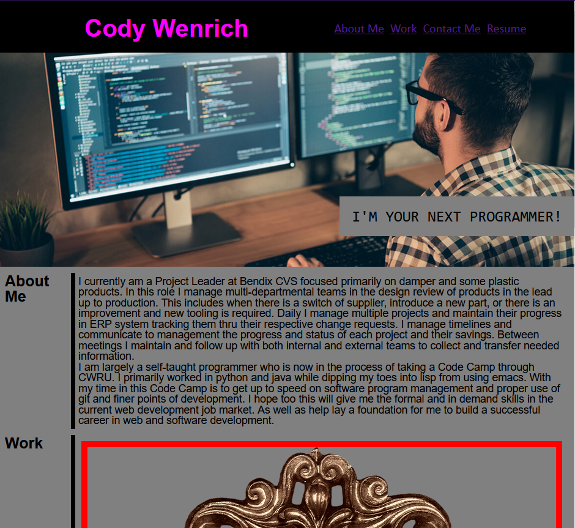
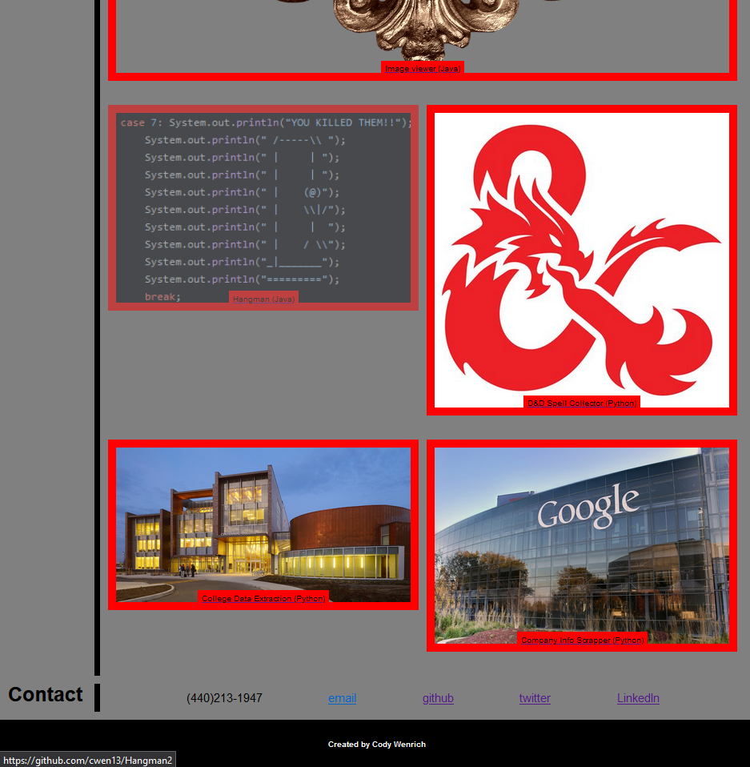

# first-portfolio
First attempt at a creating a portfolio page from scratch

## Description

This is my first attempte at creating a portfolio web page to show off my 
skills. This is part of a code camp and will be revamped or recreated from
scratch in the future. This was created with just HTML and CSS styling. In
the coming weeks I will be learning more JAvaScript and can create a more
interactive web portfolio.

## Usage

Useage is simple just navigate to the URL.

## Credits

Credit goes to teh code camp for snippets and reset.css file. As well as 
Ross the teacher of the class and Savien Love for her help polishing some
finer points with me.

## License

MIT

## Images

The follwoing are images of the finished site showing the top with the nav
bar and banner background image.

This is the bottom section of the site with one of the project tiles being
hovered over changing its opacity.
]
